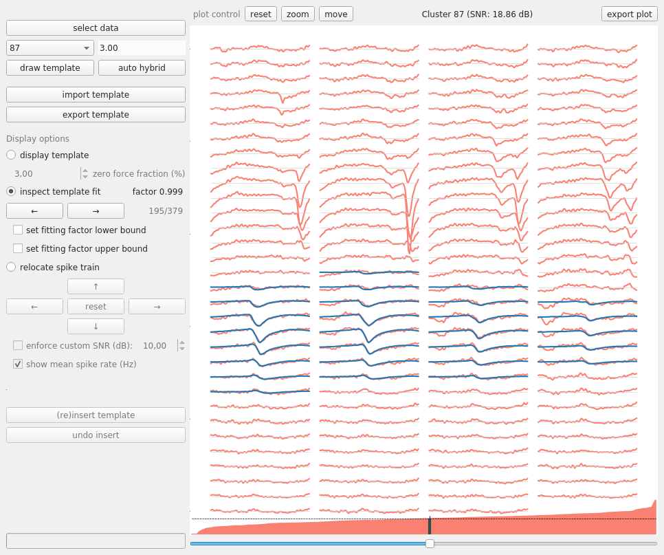

# SHYBRID README
For more detailed user information consult our [SHYBRID Read the Docs pages](https://shybrid.readthedocs.io/).

SHYBRID is a graphical user interface that allows for the easy creation of hybrid ground truth extracellular recordings. This README file contains information on how to install the program, as well as information on how to get started making extracellular spiking ground truth data. If you have any further questions feel free to contact [me](mailto:jasper.wouters@esat.kuleuven.be).

Note that the tool was developed on Linux and prefereably you also run it on Linux, although it has been tested both on Windows (10) and OS X. The tool seems to be functional on both alternative operating systems, but some warnings might pop-up that seem to be harmless.

## Installation instructions
1. Install miniconda (Python 3.x version) (or another python distribution) for your operating system, if you didn't already install it. Please follow the official conda.io [instructions](https://conda.io/projects/conda/en/latest/user-guide/install/).
2. Optional, yet recommended: create a virtual environment for SHYBRID:
```
conda create -n shybrid_env python=3
```
3. Activate the environment:
```
conda activate shybrid_env
```
4. Install the shybrid using pip:
```
pip install shybrid
```
5. To run the application execute the shybrid command:
```
shybrid
```

Keep in mind that the program is only accessible from within the shybrid conda environment (i.e., reactivate this environment after ,e.g., a reboot).

## Getting started with generating hybrid data using SHYBRID
Besides the information given here, more details on the methods used by the tool can be found in the preprint version of our [manuscript](http://biorxiv.org/cgi/content/short/734061v1).



### Prerequisites
To generate hybrid ground truth spiking data the following files are required by the tool:

* high-pass filtered recording data in binary format (e.g. recording.bin)
* probe file describing the recording probe geometry
* single-unit cluster information from a prior spike sorting either in
	* csv format, or
	* phy format
* yaml-file having the same name as the recording (e.g. recording.yml) containing:
	* binary format meta information
		* fs: sampling frequency
		* dtype : the datatype used to represent the data (only signed datatypes are supported)
		* order : the order in which the data matrix is serialized (F: by stacking matrix columns, or C: by stacking matrix rows. [more info](https://en.wikipedia.org/wiki/Row-_and_column-major_order)
	* path to probe file
	* path to cluster information

An example yaml file (recording.yml) is given below (all parameters shown are mandatory):

```
---
# parameters used by SHYBRID
data:
  fs: 25000
  dtype: float32
  order: C
  probe: /path/to/probe/probe.prb

clusters:
  csv: /path/to/clusters/clusters.csv
...
```
An example that reads single-unit cluster information directly from phy (note that the tool only considers clusters that have been marked as good clusters during a manual curation) is given below:

```
---
# parameters used by SHYBRID (using phy clusters)
data:
  fs: 25000
  dtype: float32
  order: C
  probe: /path/to/probe/probe.prb

clusters:
  phy: /path/to/phy-data
...
```

### Creating a ground truth spike train the regular way
An example dataset (with csv initial sorting results) for experimentation can be download from [here](https://cloud.esat.kuleuven.be/index.php/s/iW9gtkibJknCpos). Don't forget to complete the paths in the parameters file to correspond to the true location of the downloaded data on your local machine. __Note__: try to avoid spaces in the paths. __Note 2__: Every binary recording that has to be processed by the SHYBRID has to be kept in its own subfolder, the reason for this is that SHYBRID keeps track of the hybridization process (by outputting the ground truth labels and a binary file that supports cross-session undo functionality). Keeping multiple recordings in the same subfolder, will overwrite those files that keep track of the ground truth and will render the generated hybrid data useless.

1. Start the application as explained in the installation instructions.

2. To start the creation of hybrid ground truth data, the binary recording data has to be selected first. This can be done by clicking the __select data__ button. The application will automatically load all the other input files and parameters from the parameter file. Note that the tool operates directly on the supplied recording file, so make sure to keep a copy of your original recordings away from the SHYBRID.

3. Select a cluster from the dropdown list and choose a spike template window size. Note that for hybrid data generation the window size should be chosen sufficiently long (e.g., 5 ms). A longer window size will allow for the template to drop sufficiently close to zero at the edges of the temporal window, which is desirable to limit subtraction and insertion artefacts in the hybrid ground truth data.

4. Click the __draw template__ button to visualize the spike template of the selected cluster. By altering the zero-force fraction, the number of channels that are explicitly forced to zero in the template can be altered. A higher zero force fraction will result in more channels forced to zero.

5. Next, move to the inspect template fit display option. In this view mode, the user can assess how well the template fits the signal chunks that were used for the estimation of the template. You can browse through the chunks by clicking the arrow buttons or by manipulating the scoll bar below the plotting area. The chunks are ordered on increasing fitting factor (not on time). In this view, the user can choose bounds on the fitting factor. Very small and large fitting factor are likely due to overlapping spikes and should be excluded during hybridization, to guarantee realistic spike amplitudes in the ground truth data. Note that negative fitting factors are set to zero.

6. After choosing bounds on the fitting factors, move to the relocate spike train view. In this view the spatial location of the spike train can be changed by clicking on the arrow buttons. Also, a custom SNR can be enforced for the final hybrid spike trains. Once a proper location is chosen, the spike train can be relocated by clicking the __(re)insert template__ button. A CSV-file containing the ground truth labels and clusters is automatically created/updated after every insertion in the folder containing the recording.

7. If the resulting hybrid spike train is not satisfactory (in terms of SNR and/or location), the insertion can always be undone.

The auto-hybrid function will relocate every initially provided cluster in an automatic fashion. The fitting factor bounds are then automatically chosen based on robust statistics. The new spatial location is randomly chosen.

### Exporting template
A template can exported as a CSV-file. Every channel is exported as a row in the CSV dump. The order in which the channels are exported is depending on the order of the channels in the probe file. For proper reconstruction, the channels in the probe file should be order based on the actual geometry. More concretely, channels are assumed to be ordered by increasing x- and increasing y-coordinates, with the x-coordinate being the fastest changing variable.

A subset of channels can be exported by using the zoom functionality. All channels which have their leftmost plotted point in the zoom window are considered for exporting.

### Importing template
Ground truth data can also be generated in the absence of initial spike sorting results for a certain recording. Thi can be obtained by import an external template in CSV-format, where every row in the CSV-file represents the waveform on a channel. The window size is automatically determined. The horizontal reach parameter will control the width of the template on the probe. The offset parameter allows more control about which channel is used as a starting point. The template can also be shaped by adding additional zero-channels to the CSV.

When working with an imported template, the inspect template fit feature will be disabled until a spatial location is chosen and the template is actually inserted in the recording.

## Spike sorting performance
Once a hybrid recording is generated, this recording can be given to your favourite spike sorting package. The obtained spike sorting results (either in CSV or PHY format) can then be compared to the hybrid ground truth labels automatically.  An example script is provided in *examples/validation_example.py*.
