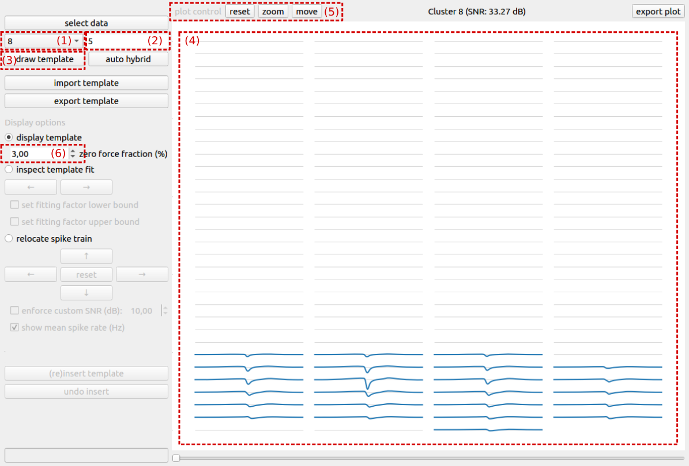
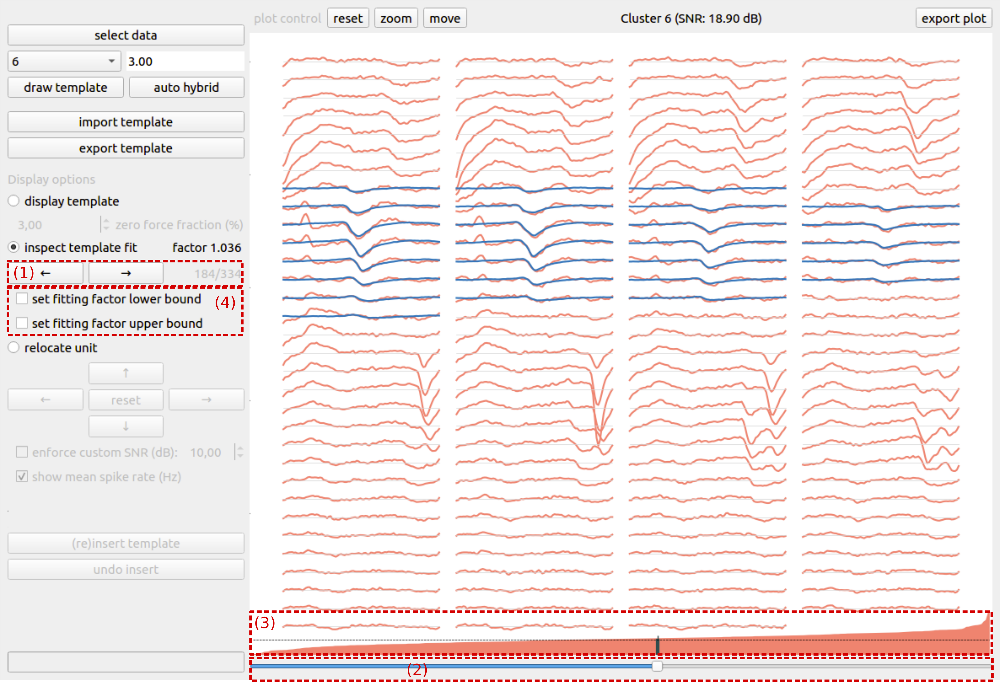
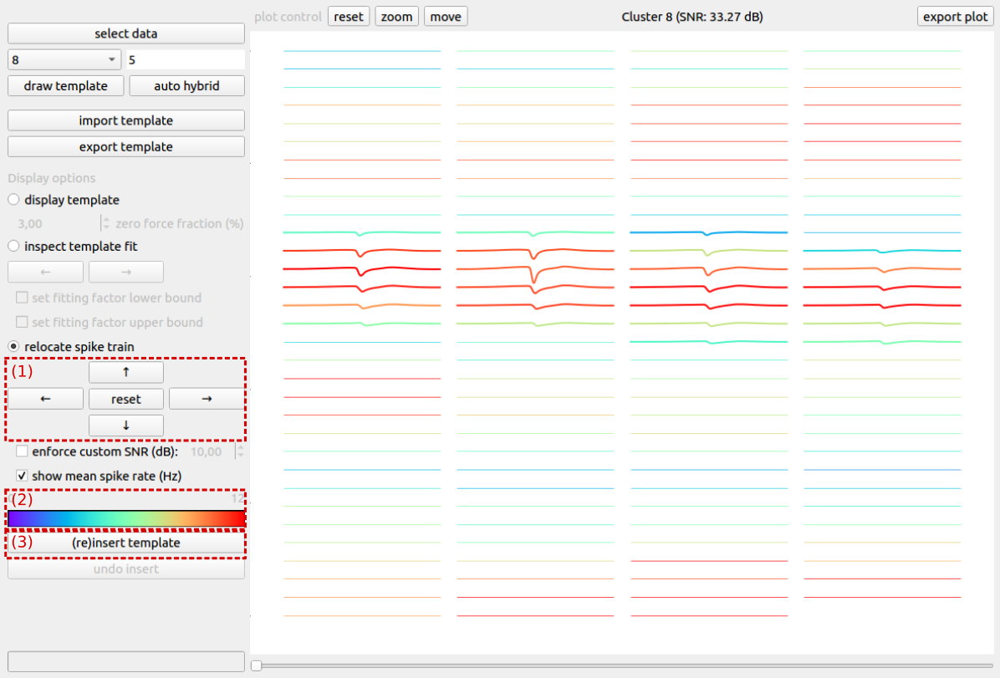
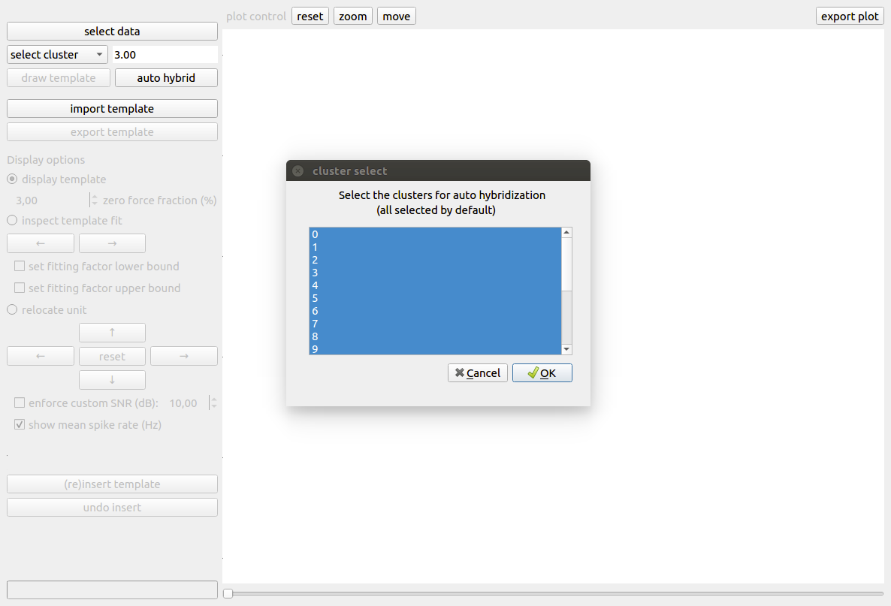

Getting Started with SHYBRID
============================
In this Section, we will walk you through the different steps of the data hybridization process.

The main idea behind the generation of hybrid data is to move a single unit, that has been identified during an initial spike sorting, to a different set of recording channels within that same recording. All single units that have been relocated make up the hybrid ground truth. Moving a unit is key to the hybridization process. Because of the relocation of a unit, potential false negatives in the initial spike sorting are prevented from being falsy characterized as false positives, compared to the case where one uses the initial spike sorting as ground truth. Note that next to the relocated units, other units might exist for which no ground truth is available. As such, hybrid recordings are only partial ground truth recordings. Also, note that the hybridization process requires multi-channel extracellular recordings. Preferably from probe-like devices, where the distance between recording channels is regular, such that the spatial structure of spike templates is also meaningful after relocation of a unit.

If you want to experience this walkthrough in a hands-on fashion, we recommend you to download the SHYBRID `example data <https://cloud.esat.kuleuven.be/index.php/s/iW9gtkibJknCpos>`_. After downloading, extract the content of the zip file on your machine. Make sure to adjust that paths in the parameter file (\*.yml) to reflect the correct location of the extracted files.

Input data
----------
Turning a binary **extracellular recording** into a hybrid ground-truth recording requires some additional information besides the recording itself.

.. note::
	Every binary recording that has to be processed by the SHYBRID has to be kept in its own subfolder, the reason for this is that SHYBRID keeps track of the hybridization process (by outputting the ground truth labels and a binary file that supports cross-session undo functionality). Keeping multiple recordings in the same subfolder, will overwrite those files that keep track of the ground truth and will render the generated hybrid data useless.

**Initial spike sorting** of the provided extracellular recording, that has been manually curated, is an important ingredient for creating a hybrid ground truth. During the manual curation, a subset of automatically identified spike trains are selected/annotated because they are believed to contain only spikes from a single neuron/unit. The initial spike sorting and manual curation can be obtained from your spike sorting workflow of choice, e.g., through a combination of `SpyKING CIRCUS <https://spyking-circus.readthedocs.io/en/latest/index.html>`_ (for sorting) and `phy <https://github.com/cortex-lab/phy>`_ (for curation).

The **probe file** of the recording device is also required by SHYBRID. This so-called probe file is required because it contains the geometric arrangement of the recording channels. This geometric knowledge is required during the relocation of a unit.

To ease the process of loading those different files into SHYBRID and providing a way for inputting recording related meta information in SHYBRID, a **parameter file** is required.

Natively, shybrid supports the following file formats:

+-------------------------+------------------+------------------------------------------+
| extracellular recording | .bin, .raw, .dat | only binary recordings are supported     |
+-------------------------+------------------+------------------------------------------+
| initial spike sorting   | .csv, phy-format | both CSV and phy-format initial spike    |
|                         |                  | sorting is supported                     |
+-------------------------+------------------+------------------------------------------+
| probe file              | .prb             | phy probe files are supported            |
+-------------------------+------------------+------------------------------------------+
| parameter file          | .yml             | parameter file is a structured YAML file |
+-------------------------+------------------+------------------------------------------+

Because many more file formats are in use, we integrated SHYBRID with SpikeInterface. Due to this integration, many of the common formats can be converted to SHYBRID compatible formats very efficiently. More details related to the input data and code examples for converting your own data can be found in :doc:`loading`.

To actually load the input data into SHYBRID, you'll have to first open the graphical user interface (GUI) by typing the following command in your (anaconda) terminal::

>> shybrid

Once the GUI is opened, click the top-left button *select data*, after which a file browser is shown. Browse to the folder where the binary recording for hybridization is located and double click the recording to open. When the file browser closes without error, your data has been succesfully loaded. After loading the data, the *select cluster* dropdown is populated with the provided initial spike sorting clusters.

Visualizing the template
------------------------
The first step of the hybridization process is the visualization of the spike template for an initial sorting cluster of choice. To visualize the spike template, first select a cluster from the *select cluster* dropdown (Fig. 1 (1)), then fill out the desired template temporal *window* length (Fig. 1 (2)) and push the *draw template* button (Fig. 1 (3)). The spike template is calculated from the provided data in combination with the initial spike sorting. After the template has been calculated, it is shown in the plotting area on the right side of the GUI (Fig. 1 (4)).

The spike template visualization is organized according to the geometrical probe information that is given. Every connected line segment that is plotted represents a recording channel/electrode and it is plotted according to the same spatial organization as the channels of the recording device. Channels in blue contribute to the template, whereas channels in gray are channels containing only noise. The plot can be manipulated using the plot control buttons (Fig. 1 (5)) on the top left of the plotting canvas.

  Fig. 1: Visualizing the template

A first visual check enables the user to verify whether or not the spike template is sensible. Noise-only channels are explicitly set to zero, but depending on the signal-to-noise ratio of the spike template, the zero-force fraction (Fig. 1 (6)) might have to be adjusted. Increasing the zero-force fraction will result in more channels that are explicitly forced to zero. Besides checking whether or not the spike template itself is sensible, it is also important to verify whether or not the template window size is chosen sufficiently large. Sufficiently large means that the spike template reaches zero on both sides of the temporal window for all channels. The gray lines are the zero lines for each channel, and are to be used as helper lines for checking whether or not the window size is adequate.

Inspecting template fit
-----------------------
Once that we have verified that the template is suitable for hybridization, we can check how well the template fits the underlying data from which it was estimated, by switching to the *inspect template fit* display option. For every spike time, an optimal template fit, i.e., template scaling factor, is calculated. Due to noise, overlapping spikes or errors in the initial spike sorting, the template fit for some spike times can become unrealistic. The goal of this step is to eliminate such unrealistic template fits from the hybridization process.

  Fig. 2: Inspecting template fit

In the inspect template fit mode, one can scroll through all signal chunks that were used during the estimation of the template. You can either scroll through by clicking the arrow buttons (Fig. 2 (1)) or by using the bottom slider (Fig. 2 (2)). The different chunks are ordered based on their fitting factor, and the fitting factor is graphically represented (Fig. 2 (3)) above the bottom slider. We recommend scrolling through the signal chunks, starting from the lowest fitting factor, until an isolated signal chunk and realistic fitting factor is identified. This fitting factor can be set as a lower bound by checking the *set lower bound* checkbox (Fig. 2 (4)). For identifying an upper bound, one can repeat this procedure, but scrolling down from the largest fitting factor until an isolated, reasonable upper bound is identified.

Relocating a unit
-----------------
After assessing the template and its fitting factors, the final step in the hybridization process cosists of relocating the unit to a different set of recording channels. As explained earlier, this key step in the hybridization process prevents false negatives in the initial spike sorting from being falsy interpreted as false positives in the case where the initial sorting would be used for ground truth. The new location of the unit can be obtained by moving its template over the probe with the arrow buttons (Fig. 3 (1)). To guide the user in the selection of a new location for the unit, the channels are color coded according to the channel's mean spike rate (Fig. 3 (2)). Moving a unit to a zone on the probe with a low spike rate will typically result in easier to sort recordings, whereas relocating a unit to a more active zone will typically result in more difficult to sort recording, e.g., due to spike overlap. When all hybridization parameters have been set (i.e, window size, zero-force fraction, fitting bounds, new location), a hybrid unit can be created by pushing the *(re)insert template* button (Fig. 3 (3)). Besides changing the underlying recording by relocating the unit's spikes to the new location, a CSV-file with ground truth spike times is automatically generated in the directory that contains the recording (*hybrid_GT.csv*).

  Fig. 3: Relocating a unit

Auto hybridization
------------------
The above procedure can be repeated for all clusters in the initial sorting. However, when many clusters are present, this procedure can become time consuming. Therefore, we provide an auto hybrid function that automatically sets conservative bounds on the fitting factors and moves the unit to a random location on probe. The window size and zero-force fraction have to be determined by the user prior to the automatic hybridization. When the *auto hybrid* button is pushed, a pop-up is shown (Fig. 4) where the user can select a set of clusters for automatic hybridization. By default, all clusters are selected.

  Fig. 4: Automatic hybridization
